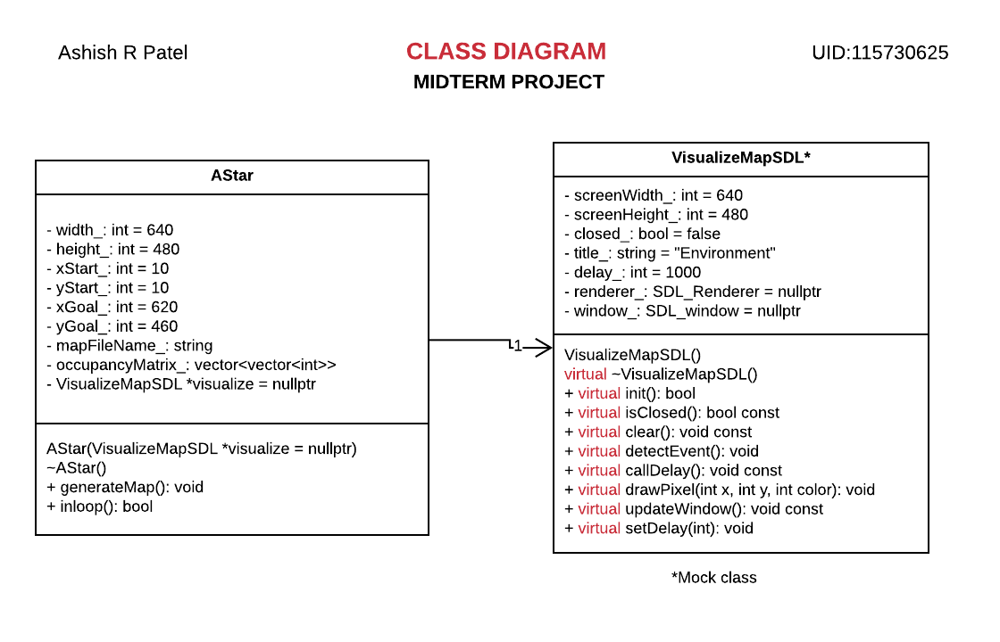

# ENPM808X: MidTerm Project 
*Building a path planning module for ACME Robotics*

[](https://opensource.org/licenses/MIT)
---

## Table of Contents
- [Overview](#overview)
- [Definitions](#define)
- [Class Diagram for GMocking](#class)
- [GMocking](#mock)
- [Dependencies](#packages)
- [Standard install via command-line](#implementation)

## <a name="license"></a> License
This project is under the [MIT License](./LICENSE)

## <a name="overview"></a> Overview 
This repo is a simple global path planning module, developed for ACME Robotics. Given an initial and final location, the module can compute shortest path using A* algorithm to reach the final location. The purpose of this project is to design a global path planning module that can be integrated to build a robotic system to navigate autonomously in a known environment.

This repository implements a C++ A* algorithm as a global planner along with:
- cmake
- googletest

Input:
- A txt file which contains, occupancy matrix of a known map.

Assumptions:
- A point robot can move from one node to another node vertically, horizontally as well as diagonally.
- The cost to move veritically and horizontally from one node to another is assumed to be equal to 1. 
- The cost to move diagonally from one node to another is assumed to be equal to 1.4142.
- The heuristic cost in A* algorithm is calculated based on euclidean distance.

## <a name="define"></a> Definitions
**1.** *[Manhattan distance](https://en.wiktionary.org/wiki/Manhattan_distance)*: The distance between two points measured along axes at right angles. <br/>
**2.** *[Euclidean distance](https://en.wikipedia.org/wiki/Euclidean_distance)*: The distance between two points in either the plane or 3-dimensional space measures the length of a segment connecting two points. Its calculated based on pythagorean theorem. <br/>
**3.** *CostToCome*: The distance between the current node and newly generated neighbour nodes. CostToCome for start node is zero. <br/>
**4.** *CostToGo or Heuristic cost*: It's the euclidean distance between the generated neighbour node to goal node. <br/>
**5.** *Total cost*: Sum of CostToCome and CostToGo. For start node it will be equal to CostToGo.

## <a name="class"></a> Class Diagram for GMocking
<p align="center">
<a target="_blank">
</a>
</p>

## <a name="mock"></a> GMocking

There are two classes VisualizeMapSDL and AStar class, I have make a mock class for VisualizeMapSDL and tested AStar class. You can find the class diagrams above.

## <a name="packages"></a> Dependencies
This module uses [SDL library](https://www.libsdl.org/), its a cross-platform development library designed to provide low level access to audio, keyboard, mouse and graphics hardware via OpenGL and Direct3D. It's written in C++ and works natively with C++. I will be using SDL version 2.0 for this project. It's license under [zlib license](https://www.libsdl.org/license.php), which unables me to use this library for any purpose, including commercial applications and can also be distributed freely. The only purpose of this library in this project is to provide visual demo of path planning algorithm.

Steps to download and install this package can be done following this simple [tutorial](http://wiki.libsdl.org/Installation).

## <a name="implementation"></a> Standard install via command-line
```
git clone --recursive https://github.com/Learner1729/ENPM808x_PlanningModule.git
cd <path to repository>
mkdir build
cd build
cmake ..
make
Run tests: ./test/cpp-test
Run program: ./app/shell-app
```

